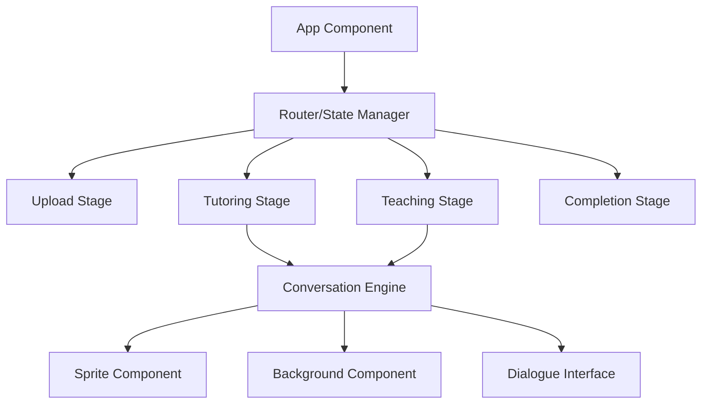

# Design Document

## Overview

The tutoring platform is a React-based single-page application that guides users through a three-stage learning process. The application uses a state-driven architecture to manage the conversation flow, visual elements, and user progression through the tutoring, teaching, and completion stages.

## Architecture

### High-Level Architecture



### Technology Stack

- **Frontend Framework**: React 18+ with functional components and hooks
- **State Management**: React Context API with useReducer for complex state
- **Routing**: React Router for navigation between stages
- **Styling**: CSS Modules or Styled Components for component-specific styling
- **File Handling**: HTML5 File API for upload functionality

## Components and Interfaces

### Core Components

#### 1. App Component
- **Purpose**: Root component managing global state and routing
- **State**: Current stage, conversation history, uploaded file data
- **Props**: None (root component)

#### 2. StageContainer Component
- **Purpose**: Wrapper for each stage with common layout elements
- **Props**: 
  - `stage`: string (upload, tutoring, teaching, completion)
  - `children`: React.ReactNode
  - `onNext`: function for stage progression

#### 3. UploadStage Component
- **Purpose**: File upload interface
- **State**: Selected file, upload status
- **Props**: 
  - `onFileUpload`: (file: File) => void
- **Features**: Drag-and-drop support, file validation

#### 4. ConversationStage Component
- **Purpose**: Base component for tutoring and teaching stages
- **Props**:
  - `stageType`: 'tutoring' | 'teaching'
  - `spriteConfig`: SpriteConfig
  - `backgroundConfig`: BackgroundConfig
  - `onComplete`: () => void

#### 5. Sprite Component
- **Purpose**: Animated character display with expression changes
- **Props**:
  - `character`: string (tutor, student)
  - `expression`: string (neutral, happy, thinking, confused)
  - `isActive`: boolean (speaking indicator)
- **Features**: CSS animations for speaking, idle states

#### 6. Background Component
- **Purpose**: Stage-appropriate background rendering
- **Props**:
  - `scene`: string (classroom, library, completion)
  - `variant`: string for different backgrounds per stage

#### 7. DialogueInterface Component
- **Purpose**: Conversational UI with natural dialogue flow
- **State**: Current message, conversation history, typing indicator
- **Props**:
  - `messages`: Message[]
  - `onSendMessage`: (message: string) => void
  - `isWaitingForResponse`: boolean

#### 8. LoginStage Component
- **Purpose**: Landing page with username/password authentication
- **State**: Username, password, validation errors
- **Props**:
  - `onLogin`: (username: string, password: string) => void
- **Features**: Form validation, accepts any credentials

#### 9. CompletionStage Component
- **Purpose**: Final stage with summary and restart options
- **Props**:
  - `conversationSummary`: ConversationSummary
  - `onRestart`: () => void

#### 10. MentalMapProvider Component
- **Purpose**: Context provider for mental map state management
- **Features**: Initializes empty mental map, provides update methods for future backend integration
- **Props**: 
  - `children`: React.ReactNode
  - `userId`: string

### Data Models

#### Message Interface
```typescript
interface Message {
  id: string;
  sender: 'user' | 'sprite';
  content: string;
  timestamp: Date;
  spriteExpression?: string;
}
```

#### SpriteConfig Interface
```typescript
interface SpriteConfig {
  character: 'tutor' | 'student';
  defaultExpression: string;
  availableExpressions: string[];
  animationDuration: number;
}
```

#### ConversationState Interface
```typescript
interface ConversationState {
  currentStage: 'login' | 'upload' | 'tutoring' | 'teaching' | 'completion';
  messages: Message[];
  uploadedFile: File | null;
  isProcessing: boolean;
  canProceed: boolean;
  mentalMap: MentalMap;
  user: UserSession | null;
}

interface UserSession {
  username: string;
  loginTime: Date;
}
```

#### MentalMap Interface
```typescript
interface MentalMap {
  userId: string;
  concepts: ConceptNode[];
  relationships: ConceptRelationship[];
  lastUpdated: Date;
}

interface ConceptNode {
  id: string;
  name: string;
  understanding: number; // 0-1 scale
  confidence: number; // 0-1 scale
  interactions: number;
  lastInteraction: Date;
}

interface ConceptRelationship {
  fromConceptId: string;
  toConceptId: string;
  strength: number; // 0-1 scale
  type: 'prerequisite' | 'related' | 'builds_on';
}
```

## Error Handling

### File Upload Errors
- **Invalid file types**: Display user-friendly error message
- **File size limits**: Implement client-side validation with clear feedback
- **Upload failures**: Retry mechanism with exponential backoff

### Conversation Flow Errors
- **Network timeouts**: Graceful degradation with offline indicators
- **Invalid responses**: Fallback to predefined responses
- **State corruption**: Reset mechanisms to recover application state

### Navigation Errors
- **Invalid stage transitions**: Prevent navigation to incomplete stages
- **Browser back/forward**: Handle browser navigation gracefully
- **Page refresh**: Persist conversation state in localStorage

## Testing Strategy

### Unit Testing
- Component rendering and prop handling
- State management logic and reducers
- Utility functions for file handling and validation
- Message formatting and conversation flow logic

### Integration Testing
- Stage-to-stage navigation flow
- File upload to conversation transition
- Sprite and background coordination
- Complete user journey from upload to completion

### User Experience Testing
- Conversation flow feels natural and engaging
- Visual transitions between stages are smooth
- Sprite animations enhance rather than distract
- Mobile responsiveness across different screen sizes

## Implementation Details

### State Management Pattern
```typescript
// Global state using Context + useReducer
const ConversationContext = createContext();

const conversationReducer = (state, action) => {
  switch (action.type) {
    case 'SET_STAGE':
      return { ...state, currentStage: action.payload };
    case 'ADD_MESSAGE':
      return { 
        ...state, 
        messages: [...state.messages, action.payload] 
      };
    case 'UPLOAD_FILE':
      return { ...state, uploadedFile: action.payload };
    case 'UPDATE_MENTAL_MAP':
      return { 
        ...state, 
        mentalMap: { 
          ...state.mentalMap, 
          ...action.payload,
          lastUpdated: new Date()
        } 
      };
    case 'INITIALIZE_MENTAL_MAP':
      return { 
        ...state, 
        mentalMap: {
          userId: action.payload.userId,
          concepts: [],
          relationships: [],
          lastUpdated: new Date()
        }
      };
    // Additional actions...
  }
};
```

### Conversation Flow Logic
- **Message Queue**: Implement queued responses for natural pacing
- **Typing Indicators**: Show sprite "thinking" before responses
- **Expression Mapping**: Link message content to sprite expressions
- **Progress Tracking**: Monitor conversation milestones for stage progression

### Visual Design Principles
- **Consistent Color Palette**: Different colors for each stage while maintaining brand consistency
- **Responsive Layout**: Mobile-first design with tablet and desktop adaptations
- **Accessibility**: ARIA labels, keyboard navigation, screen reader support
- **Performance**: Lazy loading for sprites and backgrounds, optimized animations

### File Structure
```
frontend/
└── src/
    ├── components/
    │   ├── common/
    │   │   ├── Sprite/
    │   │   ├── Background/
    │   │   └── DialogueInterface/
    │   ├── stages/
    │   │   ├── LoginStage/
    │   │   ├── UploadStage/
    │   │   ├── ConversationStage/
    │   │   └── CompletionStage/
    │   └── layout/
    │       └── StageContainer/
    ├── context/
    │   └── ConversationContext.js
    ├── hooks/
    │   ├── useConversation.js
    │   ├── useFileUpload.js
    │   └── useMentalMap.js
    ├── utils/
    │   ├── fileValidation.js
    │   ├── conversationHelpers.js
    │   └── mentalMapHelpers.js
    └── assets/
        ├── sprites/
        └── backgrounds/
```